# Dowling's Bar & Grill

Welcome to Dowling's Bar & Grill, a combination of an American sports bar and an Irish pub. The objective of this website is to provide potential customers with a website to view our menu, read about our restuarant and book a table. The goal of the website for an admin is to be able to manage all bookings. This includes the features to accept bookings, suggest a new booking time for customers, edit bookings and delete bookings. The customer will also be updated each time a change is made to their booking via email.

To achieve the goals of this project I have used full stack software development tools including HTML, CSS, JavaScript, Django and Python.

---

## Features 

### Navbar

The navbar is a feature used on all pages on the website and is vital for customers and admins to navigate the website effectively. The navbar changes if the admin is logged in to show admin controls to manage bookings and view confirmed bookings. On the navbar a user can navigate to the homepage, the menu, the contact us section and the reservations page. When an admin is logged in they can navigate to the manage bookings page and the confirmed bookings page, they also have the option to log out.

This navbar was created on my base.html template so I could import it on all pages.

<details>
<summary>Navbar</summary>
<br>


</details>

### Hero Image

The hero image appears on the homepage welcoming the user to the website. It has a background of an American sports bar with a gradient overlay. It also has a short welcome message and 2 buttons to guide users to the menu and to the reservations form.

<details>
<summary>Hero Image</summary>
<br>

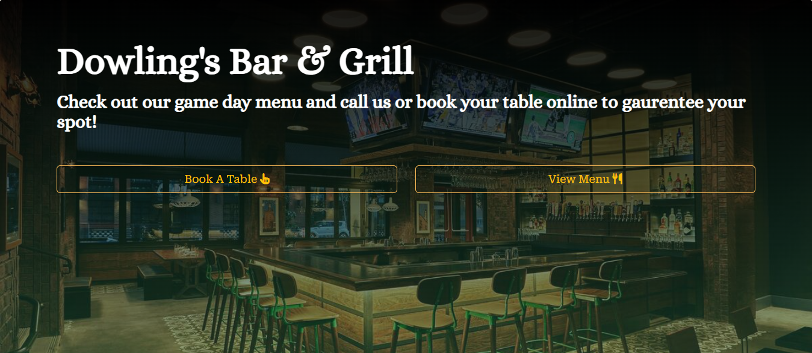
</details>

### Footer

The footer is also found on every page on the website. The footer contains 3 columns including social media links, the address of the business and business opening hours. This gives the user all the information they need for the restuarant and links to their social media for more information.

This was also created on my base.html template to make it easier to implement on all pages.

<details>
<summary>Footer</summary>
<br>

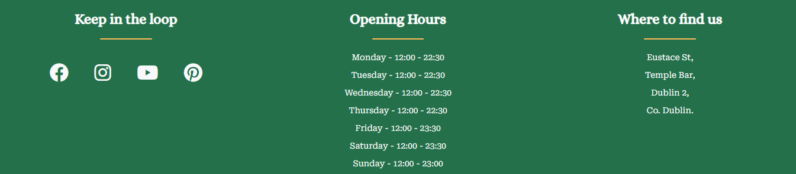
</details>

### About section

The about section appears on the homepage and it is a brief introduction to the history of Dowling's Bar and Grill. The about section outlines the history of the bar with images and also gives the user a brief description of what to expect at the bar.

This section was styled with bootstrap to create 2 side by side columns that display and image and text. This view changes for mobile to contribute to a better user experience and displays the content in one column on smaller devices. The images used were taken from Google images and are linked in my credits section below.

<details>
<summary>About Us</summary>
<br>

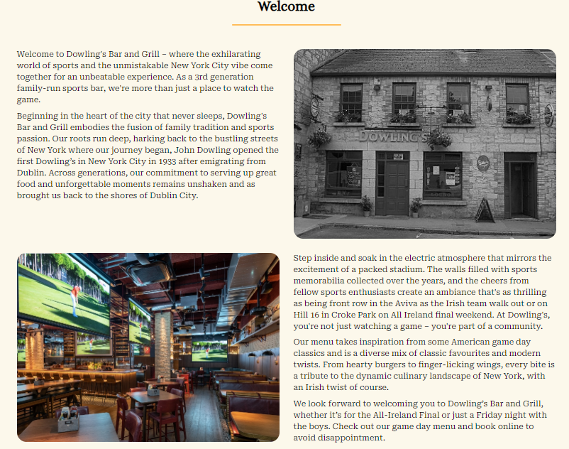
</details>

### Menu

The menu section shows the user our Starters, Mains and Desserts on offer at Dowling's Bar and Grill. The menu consists of a title, description, price and image. The menu is styled with bootsrap and my own custom css. The menu is imported from a javascript array and displayed through a function in my menu.js file. I decided to display the menu like this to keep my index.html page cleaner and to make the menu items easily editable. The function loops through the menu items and displays them on the index.html page. The array can be added to, to include as many menu items as needed.

In future iterations of this project I would like to include a new menu app so the admin can log in and edit the menu from the admin panel to keep it up to date. This was a consideration for this project but this feature was deemed to be less important that the booking app when creating a minimum viable product.

<details>
<summary>Menu</summary>
<br>

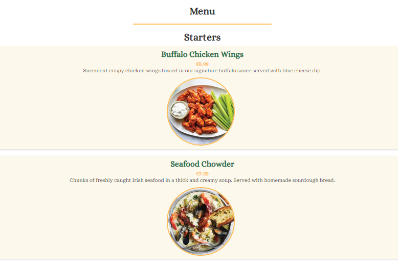
</details>

### Contact Us

The contact us section includes 2 columns. One for a Google map displaying the location of the restuarant. This was created using a Google maps api key and it is imported from my maps function in a seperate maps.js file located in the static directory. The map points to a location in Dublin's Temple Bar area as the location for my fictional restuarant.

The second column on the contact us section is a contact form that sends an email to the restuarant with the customers query. The contact us form sends the email using a SMTP server and sends it to an email address I've created for the project. The restuarant will then recieve this email with the information and can reply to the customer directly from gmail.

<details>
<summary>Contact Us</summary>
<br>

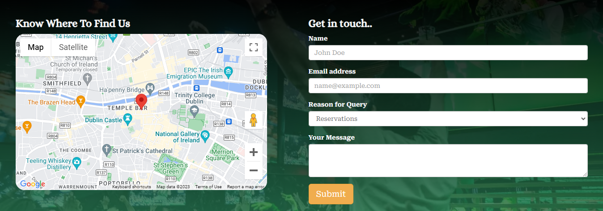
</details>

### Reservations

The reservations page is a form that allows a user to book a table at Dowling's Bar and Grill. The form has 7 fields. Name, email, phone number, date, time, number of people and a message box.

The user can book a table with the calender for a date in the future only, for a time between 12pm and 9pm. This is the times in which the bar serves food 7 days a week. The user can then select the number of people between 2 and 8. They can then add a message for a special request or query. The restuarant can cater for a max of 20 people per time slot. If there are already more than 20 people booked on a particular slot the user will be shown an error message and asked to try an alternative time.

When this form is submitted, The page will update with a message to let the user know that the booking has been submitted and they will be contacted as soon as possible for confirmation. The admin will then get an email to dowlingsbarandgrill@gmail.com to let them know there has been a new booking. This booking them appears in the admin panel manage bookings.

<details>
<summary>Reservations</summary>
<br>

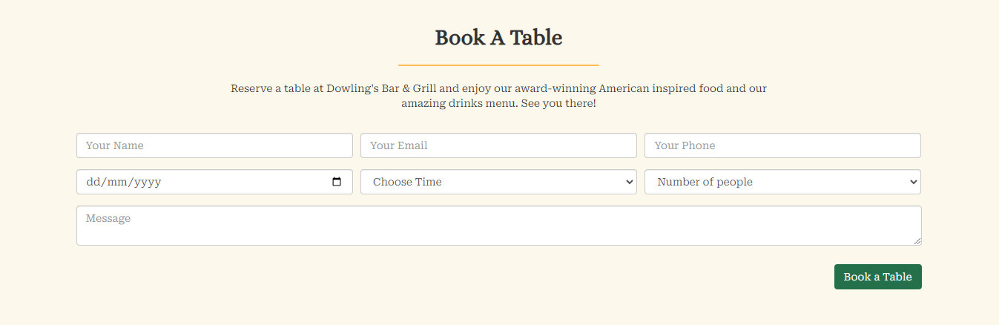
</details>

### Admin Log In

The admin log in page allows a super user to log in to the site to access admin privlidges. The admin logs in with their username and password and is redirected to the manage bookings page.

<details>
<summary>Admin Log In</summary>
<br>

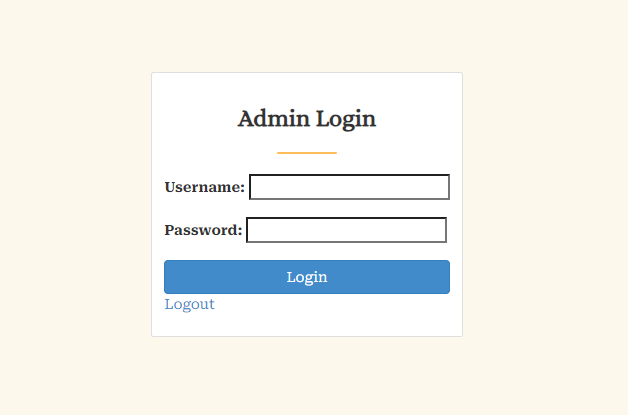
</details>

### Manage Bookings

The manage bookings page is where all bookings from the reservations form go. This view is only accessable when an admin is logged in and from here they can see all the booking information.

This page displays 9 booking cards per page. The cards are displayed in an easy to read format outlining all the booking information submitted by the customer. The admin has the option to accept the date propossed by the customer or suggest a new date. If they accept the original date the booking updates and moves to the confirmed bookings view. A success message will appear to confirm that the booking has been accepted and the customer will recieve an email confirming this also. This email is send using my email.html template.

If the booking time or date does not suit the restuarant or the customer wants to change it before it is accepted, a suggest a new date button can be used. This allows the admin to select a date and time and submit this change to update the booking. The customer will then recieve an email with the new time and date asking them to confirm if this suits. When the customer accepts this date and time, the admin can then accept the new booking and this will move to the confirmed bookings view

<details>
<summary>Manage Bookings</summary>
<br>

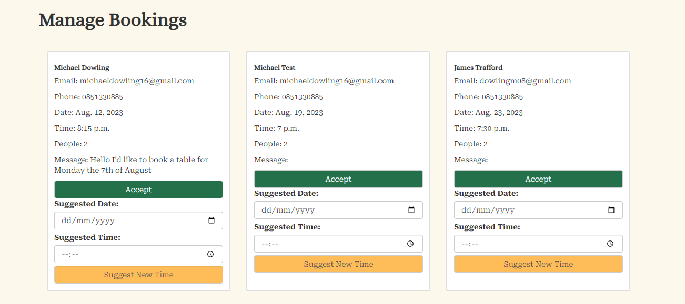
</details>


### Confirmed bookings

The confirmed bookings view is also only accessable to logged in admins. This page displays all the current bookings that have been accepted. This view will automatically delete past bookings over 1 day old. This view allows an admin to cancel a booking. This will send a confirmation email to the customer letting them know their booking has been cancelled. This view also has an edit booking option so a booking can be edited by an admin if a customer requests. To manage large amounts of bookings the view can be filtered by specific date to allow the admin to view only bookings on that date.

This view also displays 9 bookings per page using pagination, on easy to read cards that are styled with bootstrap.

<details>
<summary>Confirmed Bookings</summary>
<br>

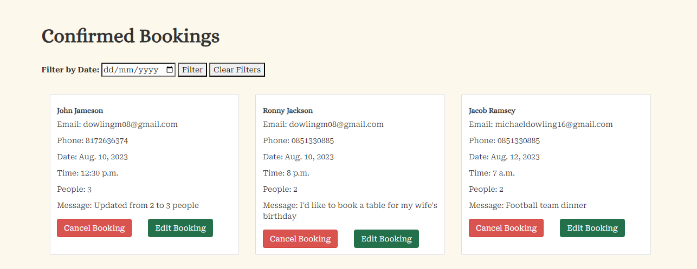
</details>

### Edit bookings

To edit a booking an admin can choose the edit button on the confirmed bookings view. This will open up the edit bookings page with the pre populated booking information. The admin can then edit any info they need or add a message to the booking and click update. This will then update the booking card in the confirmed booking view. 

<details>
<summary>Edit Bookings</summary>
<br>

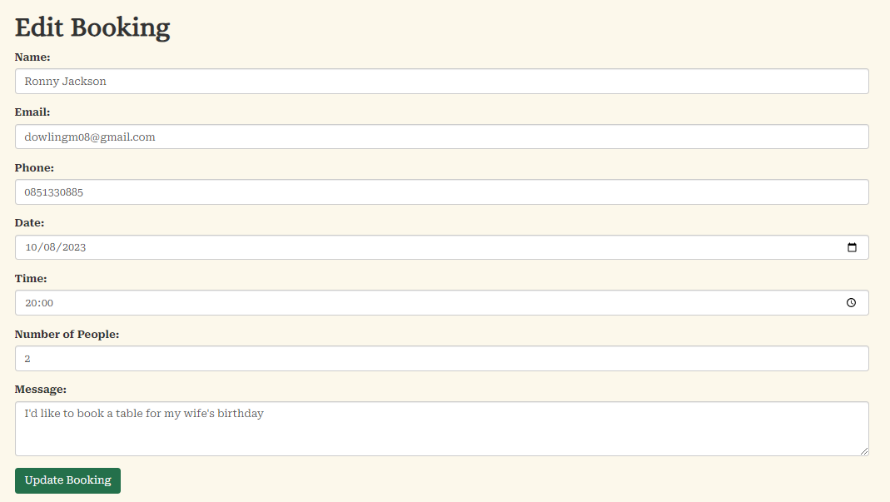
</details>

## CRUD Functionality

I have implemented CRUD functionality into this project by allowing an admin the ability to fully manage booking to the restuarant. They can accept bookings, edit bookings, suggest new time and date for bookings and cancel bookings. The customer can add bookings using the reservations form.

This functionality represents the features needed for a real world application to manage online bookings for a busy restuarant. This gives the restuarant more visability on all their upcoming bookings and the ability to edit them and filter them for specific dates. The customer is also updated in real time with emails regarding any change in their booking. This allows the resturant to save time when dealing with large amounts of bookings as all functionality can be done straight from the admin panel.

## Design

The design of my website was inspired by holidays to New York and Canada where the Irish sports bar is very popular and seen nationwide. I used a mixture of green, white and gold for my colours to represent Ireland and I used images of american sports bars to tie in with the theme.

### Colour pallette

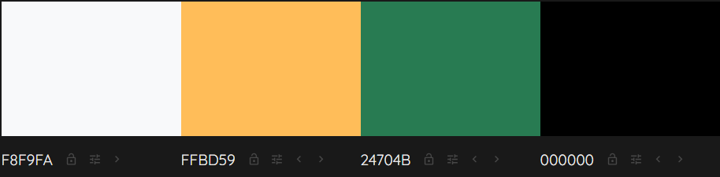

I decided to use these colours as they represent the Irish flag colours and I think it ties in well with the overall theme of my website.

### Typography

I used the fonts Roboto Serif and Alice for the main fontson this site. I liked the Alice font for the headings and logo as I thought it looked old and classy and this was the vibe i was going for mith my sports bar, being inspired by New York. I used the Roboto Serif font for the main text as it looked clean and matched the design. I used Google fonts for these and imported them into my custom CSS file.

## Agile Methodology

I used GitHub to implement agile methodology into this project by creating epics and user stories in my repository and using these to plan out my project and features to implement based on importance to achive a MVP. One week was spent on project planning where I outlined my original idea, features I'd like to include and a plan of attack. The initial sprint took 2 weeks where I implemented the main base of the project including the beginning templates and all html and css. I then reevaluated the features needed and the last sprint took 2 weeks to implement the main django features.


## Models Used


--- 

## Testing

My testing can be found in [Testing.md](TESTING.md)

## Deployment

My app is found deployed on Heroku.

### ElephantSQL Database

This app uses ElephantSQL for the PostgreSQL Database.

To obtain your own Postgres Database, sign-up with your GitHub account, then follow the steps below:

- Click Create New Instance to start a new database.
- Provide a name, usually your project name
- Select the free Tiny Turtle plan.
- Select the Region and Data Center closest to you.
- Now click on your new database name, where you can view the database URL and Password.

### Cloudinary

I used Cloudinary API to store my static files

To create your own Cloudinary API key, create an account on [Cloudinary](https://cloudinary.com/) and log in.

- You can choose to change your assigned cloud name to something else.
- On your Cloudinary Dashboard, you can copy your API Environment Variable.
- Be sure to remove the CLOUDINARY_URL= as part of the API value.

### Heroku Deployment

This app is deployed to [Heroku](https://heroku.com). After account set up follow the deployment steps below

- Select create a new app from the dropdown menu on your Heroku Dashboard
- Your app name must be unique, and then choose a region closest to you, then select Create App.
- From your app Settings, click Reveal Config Vars, and set your environment variables.

| Config vars | Description |
| ----------- | ----------- |
| CLOUDINARY_URL | Insert your own Cloudinary API key here |
| DATABASE_URL | Insert your own ElephantSQL database URL here |
| DISABLE_COLLECTSTATIC  | 1 (this is temporary, and can be removed for the final deployment)|
| SECRET_KEY | This can be any random secret key |
| EMAIL_HOST_USER | This is to send emails in my app using Gmail. This will be the email address |
| EMAIL_HOST_PASS | This is the password for the email address to allow django to send emails |

Heroku also needs two additional files in order to deploy properly.
> requirements.txt
> Procfile


You can install this project's requirements using:
> pip3 install -r requirements.txt
  

If you require additional packages that have been installed, then the requirements file needs updated using
> pip3 freeze --local > requirements.txt

  
The Procfile can be created with the following command:
> echo web: gunicorn app_name.wsgi > Procfile

replace app_name with the name of your primary Django app name

For Heroku deployment, follow these steps to connect your own GitHub repository to the newly created app:

#### Automatic Deployment

Select Automatic Deployment from the Heroku app.

#### Manual Deployment

- In the Terminal/CLI, connect to Heroku using this command: heroku login -i
- Set the remote for Heroku: heroku git:remote -a app_name (replace app_name with your app name)
- After performing the standard Git add, commit, and push to GitHub, you can now type: git push heroku main

The project should now be connected and deployed to Heroku!

## Local Deployment

This project can be cloned or forked in order to make a local copy on your own system.

For either method, you will need to install any applicable packages found within the requirements.txt file.

- pip3 install -r requirements.txt.
- You will need to create environment varibales file called env.py at the root-level, and include the same environment variables listed from the Heroku deployment steps.

Sample env.py file:

```
import os

os.environ.setdefault("CLOUDINARY_URL", "insert your own Cloudinary API key here")
os.environ.setdefault("DATABASE_URL", "insert your own ElephantSQL database URL here")
os.environ.setdefault("SECRET_KEY", "this can be any random secret key")

```

Once the project is cloned or forked, in order to run it locally, you'll need to follow these steps:

1. Start the Django app: python3 manage.py runserver
2. Stop the app once it's loaded: CTRL+C or ⌘+C (Mac)
3. Make any necessary migrations: python3 manage.py makemigrations
4. Migrate the data to the database: python3 manage.py migrate
5. Create a superuser: python3 manage.py createsuperuser
6. Everything should be ready now, so run the Django app again: python3 manage.py runserver
   
#### Cloning

You can clone the repository by following these steps:

1. Go to the GitHub repository
2. Locate the Code button above the list of files and click it
3. Select if you prefer to clone using HTTPS, SSH, or GitHub CLI and click the copy button to copy the URL to your clipboard
4. Open Git Bash or Terminal
5. Change the current working directory to the one where you want the cloned directory
5. In your IDE Terminal, type the following command to clone my repository:
git clone <https://github.com/mickdowling16/dowlings-bar-and-grill>
6. Press Enter to create your local clone.

#### Forking
By forking the GitHub Repository, we make a copy of the original repository on our GitHub account to view and/or make changes without affecting the original owner's repository. You can fork this repository by using the following steps:

1. Log in to GitHub and locate my GitHub Repository
2. At the top of the Repository (not top of page) just above the "Settings" Button on the menu, locate the "Fork" Button.
3. Once clicked, you should now have a copy of the original repository in your own GitHub account!

## Credits

During the building of my Django application I used a number of resources to help me build and implement all the features that I wanted to include. These are listed below along with the location of any images I have used for the project.

- The code I used for implementing the initial booking app was created with help from this tutorial from [Selmi Tech](https://www.youtube.com/watch?v=3_3q_dE4_qs)
- The code for sending emails from my forms and when changing bookings was created with help from [Scottish Coder](https://www.youtube.com/watch?v=1DcySa35fXw&t=7s)
- The CSS used to style most of my project was taken from the Bootstrap documentaion [Bootstrap Docs](https://getbootstrap.com/docs/5.3/getting-started/introduction/)
- The code used for creating and sending email templates was created with help from [Python Bricks](https://www.youtube.com/watch?v=Gqyk32guU_U)
- For information building my django app I referened the models cheat sheet linked here [Cheat sheet](https://cheatography.com/lewiseason/cheat-sheets/django-models/)
- I found useful information and code on building my Django views.py file from Codemy.com YouTube channel. He has videos of in depth Django tutorials that I found very useful when building this project[Codemycom youtube channel](https://www.youtube.com/@Codemycom/videos)

## Media Credits

Links to the images I used throughout this project can be found liked below

- [Dowlings' bar image](https://www.google.com/url?sa=i&url=https%3A%2F%2Fwww.tripadvisor.com%2FAttraction_Review-g1060660-d8669808-Reviews-The_Garden_at_Dowlings_Pub-Athenry_County_Galway_Western_Ireland.html&psig=AOvVaw38bn6WTslnRGHwDJT7VZSa&ust=1691696630919000&source=images&cd=vfe&opi=89978449&ved=0CBEQjRxqFwoTCLDwlJqr0IADFQAAAAAdAAAAABAJ)
- [Dowling's bar inside](https://hoteldesigns.net/wp-content/uploads/2018/11/Champions-photo-by-Tom-Bird-48-800x533.jpg)
- [Hero Image](https://assets3.thrillist.com/v1/image/3055098/1200x630/flatten;crop_down;webp=auto;jpeg_quality=70)
- [Contactus background image](https://assets3.thrillist.com/v1/image/2859420/1584x1054/crop;webp=auto;jpeg_quality=60.jpg)

<details>
<summary>Menu Image Links</summary>
<br>

- [Apple Pie](https://kristineskitchenblog.com/wp-content/uploads/2021/04/apple-pie-1200-square-592-2.jpg)
- [Banana Split](https://www.tasteofhome.com/wp-content/uploads/2018/01/All-American-Banana-Split_EXPS_FT20_37953_F_0716_1.jpg?fit=700%2C1024)
- [Beef Burger](https://perrysfieldtofork.co.uk/product/junior-chef-bbq-burger-making-february-2024/)
- [Buffalo Wings](https://www.thespruceeats.com/thmb/JmNpXwN4cxjDVnzYP0uEeDQEaJg=/750x0/filters:no_upscale():max_bytes(150000):strip_icc():format(webp)/basic-buffalo-hot-wings-recipe-100937-hero-02-c47e70101cea4c05b427bf762f42454c.jpg)
- [Chicken Burger](https://www.hintofhealthy.com/wp-content/uploads/2021/07/Crispy-Chicken-Burger-2-1.jpg)
- [Chicken Strips](https://mybelizefood.com/uploads/restorants/8e3aae50-6f2f-4352-864e-a8acdcd4ba9e_large.jpg)
- [Sundae](https://cookienameddesire.com/wp-content/uploads/2018/05/brownie-sundae.jpg)
- [Mozzerella sticks](https://images.themodernproper.com/billowy-turkey/production/posts/2021/Homemade-Mozzarella-Sticks-9.jpeg?w=800&q=82&fm=jpg&fit=crop&dm=1638935116&s=25d4195d9b6f458690bd6cf685b4d13f)
- [Nachos](https://i.pinimg.com/564x/34/50/82/345082af28e08c67b15881114bcc1628.jpg)
- [Peacan Pie](https://cdn.apartmenttherapy.info/image/upload/f_auto,q_auto:eco,c_fill,g_center,w_730,h_913/k%2FPhoto%2FRecipes%2F2019-11-how-to-pecan-pie%2F2019-10-21_Kitchn88235_HT-Pecan-Pie)
- [Chowder](https://img.taste.com.au/F8v1Lp5K/w643-h428-cfill-q90/taste/2018/05/seafood-chowder-137923-1.jpg)
- [Steak](https://media.istockphoto.com/id/498050296/photo/grilled-t-bone-steak-with-potato-wedges.jpg?s=1024x1024&w=is&k=20&c=D2MqGk4NXYJP50VjM2UsfLwLBFPKDWhq7YzdXWd0wgM=)

</details>