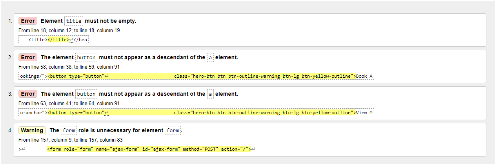
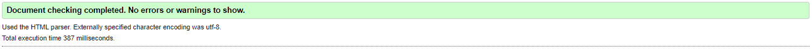
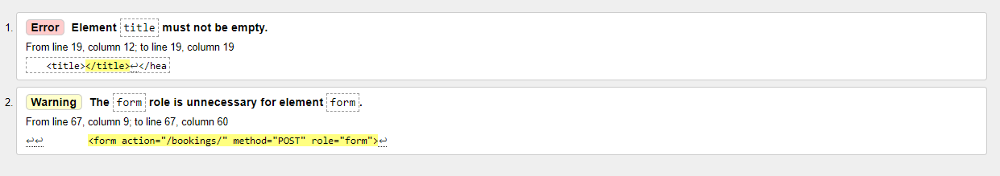

# Testing
---

## HTML Testing

To test my HTML code I used [The W3C Markup Validation Service](https://validator.w3.org/). Because my code contained Jinja syntax I tested my using the test by URI feature. Below are the recorder results

Index.html page

 
- Errors in first test. 
  

- After fixing these few errors by removing the button tag and just using an a tag, and adding code to my homepage view to populate page title. All tests passed

Reservations Form Page

 
- Errors in first test. These were similar to the errors on the homepage and an easy fix
  

- After fixing these few errors by adding code to my bookings view to populate page title and removing the role of the form. All tests passed

