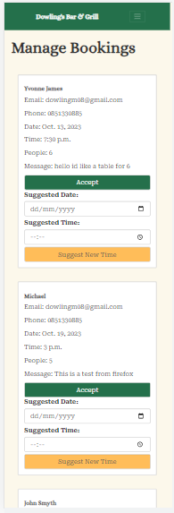

# Testing
---

## HTML Testing

To test my HTML code I used [The W3C Markup Validation Service](https://validator.w3.org/). Because my code contained Jinja syntax I tested my HTML code using the test by URI feature. Below are the recorder results. For the pages that required an admin to be logged in this approach did not work and I had to test the using the below steps.

In order to properly validate my HTML pages with Jinja syntax for authenticated pages, I followed these steps:

- Navigate to the deployed pages which require authentication
- Right-click anywhere on the page, and select view page source
- This displays the entire "compiled" code, without any Jinja syntax.
- Copy everything, and use the validate by input method.
- Repeat this process for every page that requires an admin to be logged in

Index.html page

 
- Errors in first test. 
  

- After fixing these few errors by removing the button tag and just using an a tag, and adding code to my homepage view to populate page title. All tests passed

Reservations Form Page

 
- Errors in first test. These were similar to the errors on the homepage and an easy fix
  

- After fixing these few errors by adding code to my bookings view to populate page title and removing the role of the form. All tests passed

Admin Log In Page

 
- Errors in first test on log in page. These were similar to the errors on the homepage and an easy fix
  

- After fixing this error by adding code to my log in view to populate page title. All tests passed

Manage Bookings Page

 
- Errors in first test show there is multiple duplicate IDs. This was caused by having an ID value on the card and looping through for multiple cards causing the ID to duplicate.
  

- To fix these errors by changing all the id names to classes

Confirmed Bookings Page

 
- No errors were found on my confirmed bookings page.
  

Edit Bookings Page

 
- 3 errors were found on my edit bookings page. Page title as before and an error with the prepopulated code for date and time.
  

- After fixing the value of the time and date on my edit bookings form to properly pre populate with the correct format my code passed with no errors

Booking confirmation Email Template

 
- No errors were found in my booking confirmation email template
  

Cancel Booking Email Template

 
- No errors were found in my cancel bookings email template
  

Suggest a time Email Template

 
- No errors were found in my suggest a time email template
  

## CSS Testing

To test my CSS file I used [CSS Jigsaw Validator](https://jigsaw.w3.org/css-validator/). I copy and pasted my CSS file into the validator and it returned no errors

CSS Testing

 
- No errors were found
  

## JavaScript Testing

To test my JavaScript code I used [JShint Validator](https://jshint.com/) to validate all of my JS files. The results are listed below.

Menu.js Test

 
- No errors were found in my menu.js file
  

Map.js Test

 
- There were a couple of undifined google variables in my JavaScript code. and one unused variable in mymap. These variables are pulled for the Google maps API and my google maps shows on my page without any issue. When trying to fix these errors my map dissapears from my page. I decided to revert back to the code I have so my map shows and try to fix the bug at a later time.
  

## Python Testing

I have used [CI Python Linter](https://pep8ci.herokuapp.com/) to validate all of my Python files. Below are the results.

Settings.py Test

 
- There were a couple of errors to do with line length in my settings.py file. When I fixed these errors my code passed 
  

- All tests passed

urls.py main

 
- There were no errors found in my main urls.py file
  

wsgi.py

 
- There were no errors found in my wsgi.py file
  

asgi.py

 
- There were no errors found in my wsgi.py file
  

views.py

 
- There were errors found in my views.py file for too long line lengths.
  

- After fixing the line lengths my tests passed with no errors
  

models.py

 
- There were no errors found in my models.py file.
  

urls.py booking app

 
- There were no errors found in my urls.py file in my booking app.
  

admin.py

 
- There were no errors found in my admin.py file
  

apps.py

 
- There were no errors found in my apps.py file
  

## Browser Compatibility

I've tested my app on multiple browsers including Chrome, Microsoft Edge and Firefox.

Chrome Compatibility

 
- My app was built using Google chrome and all of my development took place on Google chrome. No issues were found when using this browser and everything is working as expected. My site features work as intended and emails send correctly to users. 
  

Edge Compatibility

 
- when testing my app on Microsoft edge everything worked as expected. The styles remained consistant and emails sent without issues. There was not any difference in performance when testing on this browser
  

Firefox Compatibility

 
- when testing my app on Firefox everything worked as expected. Styles were the same except for the form elements where drop down menus and calenders looked different as expected on a different browser. All my emails and reservations form worked as expected and my alerts popped up when forms were submitted
  

## Responsiveness

When testing responsiveness I used my laptop, phone and tablet along with Google developer tools to test the app on different screen sizes. I styles my app with bootstrap to account for smaller screen sizes and for it to be responsive on mobile and tablet. It works as expected on these different screen sizes and below are screenshots from the manage bookings admin page on different devices.

- Mobile(dev tools)

- Tablet Responsiveness(dev tools)

- Laptop Responsiveness(dev tools)

- Desktop Responsiveness(dev tools)

## Lighthouse Audit

I tested my deployed app speed on lighthouse to check for major issues

